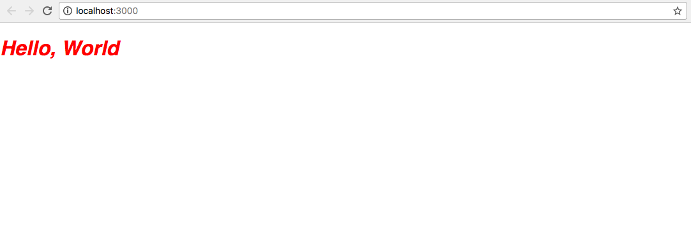
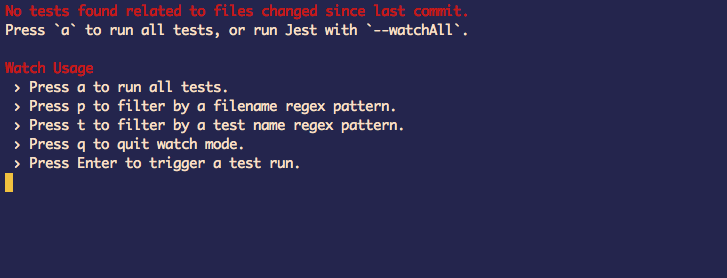
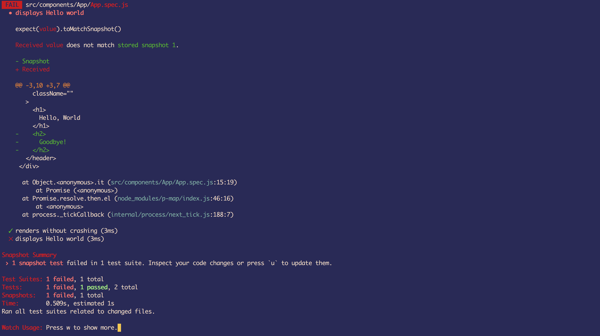
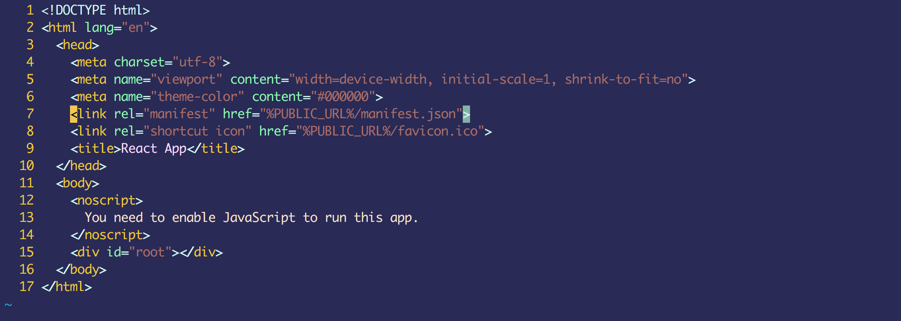

# Welcome to React Training

## How It's Different
This isn't a tutorial. You won't follow a set of directions step-by-step.
Instead, you will get an application at a certain state, a failing test that
will pass once you learn and apply the concepts, and a set of goals with
pointers to resources.

Think of it as a self-guided tour through React. The goal isn't to have you copy
and paste or read a wall of text, the goal is to make you code and to learn
through trial and error.

## How It Works

When you are ready:

1. Fork the repo.
2. Go to __Settings__ and click __Collaborators__
3. Add Your Teammates as collaborators (this way they'll be able to give
   feedback)

4. Clone the repo locally
5. Checkout the first branch `10`
6. Make a new branch from that: `git branch 10-me`
7. After that, work through the changes in the README
8. Whenever you want feedback. Create a pull request for your branch onto the
   step branch. In this case, you would create a pull request to pull `10-me`
into `10.`. Be sure to assign one of your collaborators, they will give you
feedback.
9. You can also check progress by running `npm test`. If all the tests pass,
   you've mastered the concepts and are ready to submit your final PR.

## Welcome to Branch 10!

Welcome to the first step. To begin make sure everything is working.

- Run `npm install` to get all the dependencies loaded up.
- Next, start up the app with `npm start`.

You should see something like this:



Next, make sure the tests are working.

Run `npm test`.

You should see something like this:



Type `a` to run all the tests. This is where things go a little crazy.

You'll probably see something like this:



That's fine. Every module will start with failing tests. As you learn about
React, you'll update the code. If you update things correctly, the tests will
pass.

You won't always have passing tests, you may also need to update styles on
occasion. When that happens, you'll get a screenshot to try and match. Styles,
though are less important. You probably already can do most of that and the goal
is not to create pixel perfect renditions.

#### Last Things

Since the goal of the training is to learn React. You are using the code
generated by [create-react-app](https://github.com/facebook/create-react-app) as
a scaffolding. So you won't see skeletor or some of our usual build tools.
That's more for convenience than anything else.

## Getting React On a Page

If you open the public/index.html file, you'll notice there not a lot of stuff
in there. In fact, it doesn't have anything other than the `<head>` and `<body>`
elements and a `<div>`.




Probably the strangest thing about React is that it starts with nothing (no
markup, no page elements) and builds everything. It doesn't manipulate HTML
elements on a page. It creates all the elements, then puts them on the page.
This is why it doesn't play nicely with a lot of CMS files that create markup
server-side (although you can create React code server-side).

So where is all the HTML? The markup lives inside React files. It's actually
some JavaScript code, but it looks pretty standard markup. Here's the code for
`src/componentes/App/App.js`:

```javascript
import React, { Component } from 'react';
import './App.css';


class App extends Component {
	render() {
		return (
			<div>
				<header className="">
					<h1>Hello, World</h1>
				</header>
			</div>
		);
	}
}

export default App;
```

The HTML in a React file is sometimes called JSX since it's not real HTML. React
parses the pseudo-HTML and transforms it into a JavaScript representation and
then builds the actual HTML.

This is not a big deal, but occasionally there are some naming conflicts. If you
paid attention to the above code, you'll notice that the `<header>` element
doesn't have a `class=""`. It has `className`. Since `class` is a reserved
JavaScript keyword, they had to make a slight change.

Now how does the code make it onto the page?

At some point, you need to tell React where to put the generated markup. This is
usually in the `index.js` file. In this file, you are using the ReactDOM tool to
inject the React components into a root element:

```javascript
import React from 'react';
import ReactDOM from 'react-dom';
import './index.css';
import App from './components/App/App';

ReactDOM.render(<App />, document.getElementById('root'));
```

Notice that you are importing the `App` as if it were a function, but you are
using it as if it were a special HTML element. That's part of the beauty of
React. You are essentially building customized elements. You can then nest these
custom elements inside other elements. This means that you should (in theory) be
able to start at the root of your project and find everything nested. There
should be no outside markup or manipulations.

This all means that if you ever get lost when you are trying to find some code,
you probably need to either drill down into child Components (like `App`) or
go up into a parent component (in this case, the root
component---`index.js`---which imports `App`).

This also leads to your first test. If you open
[src/components/App/App.spec.js](https://github.com/jsmapr1/react-step-by-step/blob/10/src/components/App/App.spec.js),
you'll see the tests for the `App` component. The first test emulates loading
the app onto a page.

```javascript
it('renders without crashing', () => {
  const div = document.createElement('div');
  ReactDOM.render(<App />, div);
  ReactDOM.unmountComponentAtNode(div);
});
```

That test should pass. The next test, however will fail:

```javascript
it('displays Hello world', () => {
	const wrapper = shallow(<App />);
	expect(wrapper).toMatchSnapshot();
})
```

This test uses a library called [Enzyme](https://github.com/airbnb/enzyme) and a
testing library called [Jest](https://facebook.github.io/jest/) to render html
elements into a string format.

The `shallow` method builds out a specific component. And `.toMatchSnapshot()`
converts that to a string representation (you can see the string by going into
the `__snapshots__` directory on the same level as the test).

The test makes sure that the element that you will
generate---`wrapper`---matches the element hope to
create---`.toMatchSnapshot()`.

If you run the test now, you should see a failing test that looks like this:


This failing test is telling you that you want a component that will create a
`<div>` with a `<h1>` contain 'Hello, World' and an `<h2>` containing
'Goodbye!'.

The red lines indicate that the `<h2>` is missing.

Here's your first assignment, make that test pass. It should be fairly simple,
all you need to do is change the JSX in `src/component/App/App.js`.

Try it out and see if you can pass the test.

If the tests passes, great work. You can move on to the next branch. Submit a
Pull Request if you want. This one is rather simple, though, so it's not
strictly necessary.

