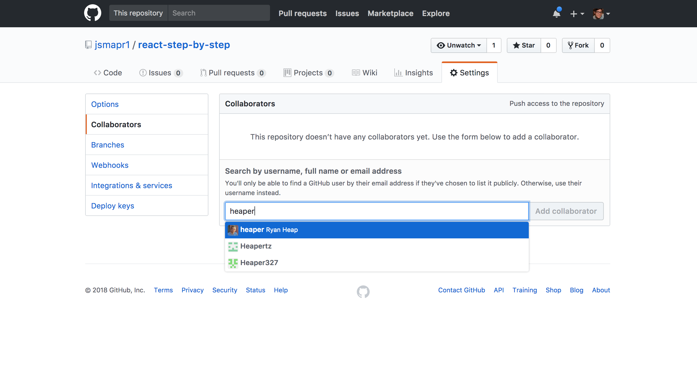

# Welcome to React Training

## How It's Different
This isn't a tutorial. You won't follow a set of directions step-by-step.
Instead, you will get an application at a certain state, a failing test that
will pass once you learn and apply the concepts, and a set of goals with
pointers to resources.

Think of it as a self-guided tour through React. The goal isn't to have you copy
and paste or read a wall of text, the goal is to make you code and to learn
through trial and error.

## How It Works

When you are ready:

1. Fork the repo.
2. Go to __Settings__ and click __Collaborators__
3. Add Your Teammates as collaborators (this way they'll be able to give
   feedback)

4. Clone the repo locally
5. Checkout the first branch `10`
6. Make a new branch from that: `git branch 10-me`
7. After that, work through the changes in the README
8. Whenever you want feedback. Create a pull request for your branch onto the
   step branch. In this case, you would create a pull request to pull `10-me`
into `10.`. Be sure to assign one of your collaborators, they will give you
feedback.
9. You can also check progress by running `npm test`. If all the tests pass,
   you've mastered the concepts and are ready to submit your final PR.

## Welcome to Branch 10!
